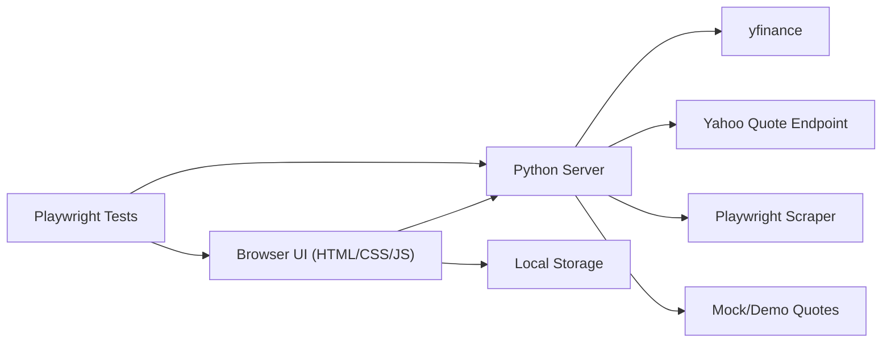
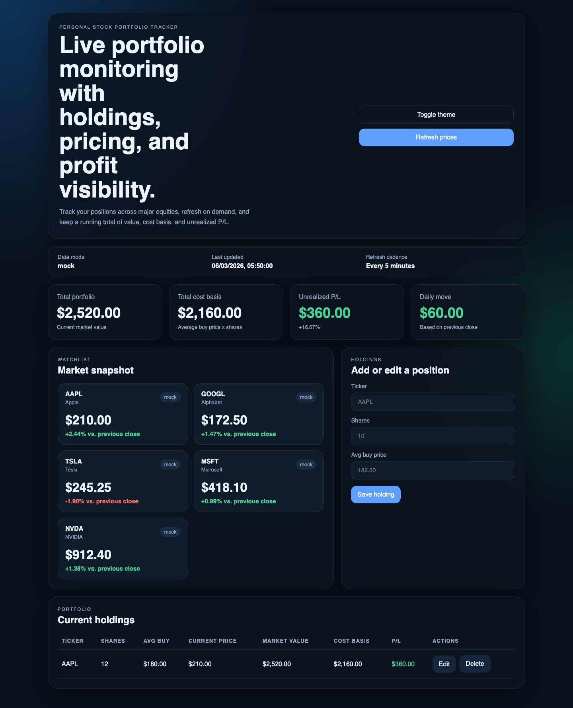
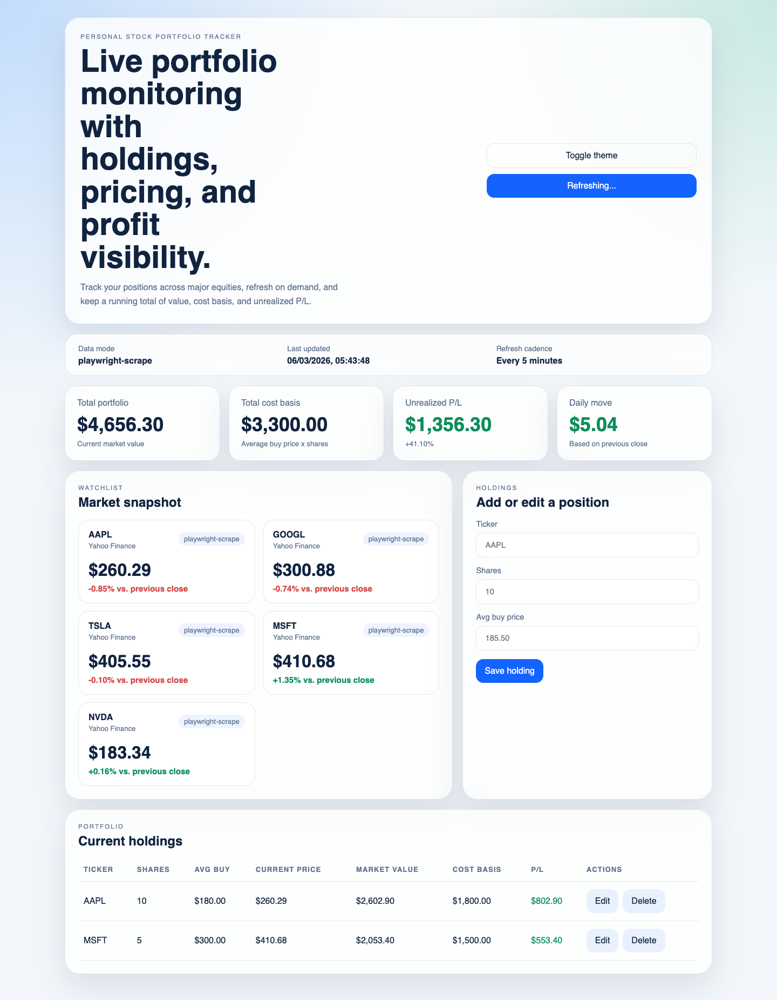

# Personal Stock Portfolio Tracker

A self-contained stock portfolio tracker with a lightweight Python backend, responsive frontend, live quote fallbacks, and Playwright end-to-end coverage.

## Why This Is a GPT-5.4 Demo

This project is meant to demonstrate a focused subset of GPT-5.4-style capabilities in a concrete, reviewable form:

- building a non-trivial app from an empty workspace
- planning and executing a multi-step coding workflow end to end
- generating and running Playwright automation
- operating a live browser session to verify UI behavior
- recovering when preferred data providers are unavailable by using fallbacks

It is best understood as a practical coding-and-browser-agent demo, not as a proof of every GPT-5.4 release claim.

## Architecture



## Screenshots

### Visible browser demo



### Live-data mode



## Features

- Watchlist for major tickers such as `AAPL`, `GOOGL`, `TSLA`, `MSFT`, and `NVDA`
- Quote fetching with a provider chain:
  - `yfinance` when available
  - Yahoo Finance quote endpoint fallback
  - Playwright scraping fallback
  - deterministic demo data fallback for known symbols
- Portfolio holdings management:
  - add holdings
  - edit holdings
  - delete holdings
- Portfolio metrics:
  - total value
  - total cost basis
  - unrealized profit/loss
  - daily move based on previous close
- Manual refresh plus auto-refresh every 5 minutes
- Dark/light mode toggle with persistence
- Responsive layout for desktop and mobile
- Expanded Playwright end-to-end coverage for totals, edit/delete flows, persistence, and mobile workflow

## Tech Stack

- Backend: Python standard library HTTP server
- Frontend: plain HTML, CSS, and JavaScript
- Browser automation/tests: Playwright

## Project Structure

```text
.
├── public/
│   ├── index.html
│   ├── app.js
│   └── styles.css
├── scripts/
│   └── scrape-quotes.mjs
├── tests/
│   └── portfolio.spec.js
├── playwright.config.js
├── package.json
├── requirements.txt
└── server.py
```

## Requirements

- Python 3.9+
- Node.js 20+ recommended
- npm
- Google Chrome installed locally if you want to use the system-Chrome Playwright path used by this project

## Setup

### 1. Install Python dependencies

```bash
pip install -r requirements.txt
```

### 2. Install Node dependencies

```bash
npm install
```

## Run the App

### Mock/demo mode

Mock mode is useful for deterministic demos and test assertions.

```bash
PORTFOLIO_DATA_MODE=mock python3 server.py
```

Open:

```text
http://127.0.0.1:8000
```

### Live-data mode

```bash
python3 server.py
```

In live mode, the app tries providers in this order:

1. `yfinance`
2. Yahoo Finance quote endpoint
3. Playwright scraping
4. demo fallback for known symbols

## Run Tests

```bash
npx playwright test
```

The Playwright config starts the local server automatically in mock mode and retains traces/screenshots on failure.

## Notes on Data Providers

- `yfinance` is preferred but optional at runtime.
- If `yfinance` is not installed or unavailable, the app falls back to public quote retrieval and then to Playwright scraping.
- Playwright scraping is slower and more brittle than API-based retrieval, but it keeps the app functional when the preferred provider is unavailable.

## Demo Flow

Recommended demo sequence:

1. Start the app in mock mode.
2. Add `AAPL` and `MSFT`.
3. Refresh prices.
4. Toggle dark mode.
5. Edit one holding.
6. Delete one holding.
7. Resize to mobile width.
8. Run the Playwright suite.

## Demo Script

If you are screen-recording or presenting this repo, use this tighter sequence:

1. Start the app in mock mode.
2. Open `http://127.0.0.1:8000`.
3. Add `AAPL` with `10` shares at `180`.
4. Add `MSFT` with `5` shares at `300`.
5. Click `Refresh prices`.
6. Toggle dark mode.
7. Edit the first holding and change the share count.
8. Delete the second holding.
9. Resize to mobile width and show the responsive layout.
10. Run `npx playwright test` and show the passing result.
11. Optionally rerun in live-data mode to show provider fallback behavior.

## What This Demo Demonstrates

This repository is a good demo of:

- Complex coding on a non-trivial app built from scratch
- Agentic workflow execution across planning, implementation, debugging, and verification
- Playwright test generation and browser automation
- Visible browser operation for a live UI workflow
- Resilient fallback logic when preferred market-data providers are unavailable

In practical terms, this demo shows:

- a complete working app
- a deterministic mock mode for repeatable tests and recordings
- a live-data mode with provider fallback behavior
- a passing Playwright suite covering CRUD, persistence, and mobile behavior
- a browser-driven demo flow covering add, edit, delete, refresh, theme toggle, and responsive resize

## What This Demo Does Not Demonstrate

This repository is not strong evidence for:

- deep web research or multi-source synthesis
- large tool-search ecosystems or MCP-style tool selection
- 1M-context or very long-context workflows
- spreadsheet, document, or presentation generation
- explicit token-efficiency or `/fast` mode measurement
- custom confirmation-policy tuning

It only partially demonstrates:

- computer use beyond the browser
- screenshot-driven interaction
- native desktop-style automation across arbitrary applications

The browser automation here is primarily Playwright-based web interaction, which is strong evidence for browser-task execution, but not a full proof of generalized desktop computer use.

## Known Limitations

- This is a lightweight local project, not a production-grade deployment setup.
- Live quote sources may change behavior or rate-limit requests.
- Holdings are stored in browser local storage, not a database.
- The Playwright scraping fallback depends on the target site structure remaining stable.

## License

This project is licensed under the MIT License. See [LICENSE](LICENSE).

## Suggested Next Improvements

- Add charts and allocation breakdowns
- Add CSV import/export
- Add server-side holdings persistence
- Add caching and rate-limit handling for quote providers
- Expand Playwright coverage for edit/delete/theme persistence/mobile layout
